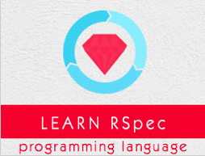

```
Roberto Nogueira  
BSd EE, MSd CE
Solution Integrator Experienced - Certified by Ericsson
```
# TutorialsPoint RSpec



**About**

`RSpec` is a unit test framework for the Ruby programming language. `RSpec` is different than traditional xUnit frameworks like JUnit because RSpec is a Behavior driven development tool. What this means is that, tests written in `RSpec` focus on the "behavior" of an application being tested. `RSpec` does not put emphasis on, how the application works but instead on how it behaves, in other words, what the application actually does. This tutorial will show you, how to use `RSpec` to test your code when building applications with Ruby.

[Homepage](https://www.tutorialspoint.com/rspec/index.htm)

## Topics
```
RSpec Tutorial
[ ] Home
[ ] Introduction
[ ] Basic Syntax
[ ] Writing Specs
[ ] Matchers
[ ] Test Doubles
[ ] Stubs
[ ] Hooks
[ ] Tags
[ ] Subjects
[ ] Helpers
[ ] Metadata
[ ] Filtering
[ ] Expectations
RSpec Resources
[ ] Quick Guide
[ ] Useful Resources
[ ] Discussion
Selected Reading
[ ] Developer's Best Practices
[ ] Questions and Answers
[ ] Effective Resume Writing
[ ] HR Interview Questions
[ ] Computer Glossary
[ ] Who is Who
```
